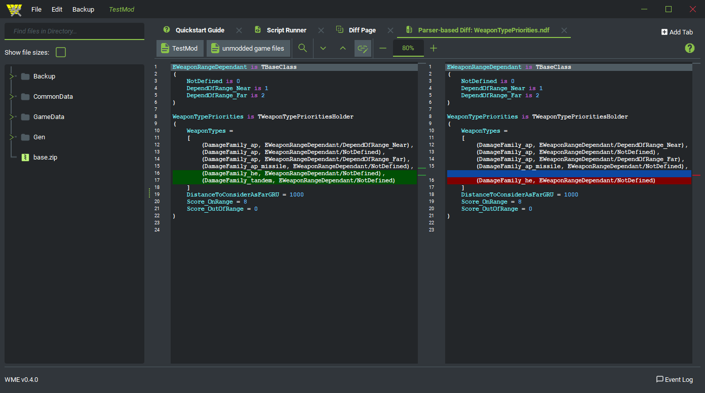

WARNO Mod Editor (WME) is a modding tool for Eugen System's real-time tactics game [WARNO](https://store.steampowered.com/app/1611600/WARNO/). WME offers a graphical user interface from which mods can be created, edited and managed. It is written in Python and uses PySide6 for the GUI.

 TODO: this likely has to be a url. Imgur maybe?

### Getting and running WME

##### Requirements

WME runs on Windows 10. I have not yet tested it for Windows 11, but it should run. In any case, WME requires a WARNO installation to be present on your machine.

##### Running WME as .exe

Head to [releases](https://github.com/Jonitr0/WarnoModEditor/releases) and download the latest version. It is an executable that you can use right away, no installation required.

##### Running WME from source

Set up a Python 3.10 environment, install [PySide6](https://pypi.org/project/PySide6/) and [qt-material](https://pypi.org/project/qt-material/), download the source code from this repository and run [main.py](https://github.com/Jonitr0/WarnoModEditor/blob/main/main.py).

##### First steps

When you first start WME, you might get asked to enter the path to your WARNO installation. 

Please refer to the [Quickstart Guide](https://github.com/Jonitr0/WarnoModEditor/blob/main/resources/markdown/Quickstart.md) to learn how to use WME.

### Feedback

If you encounter any bugs, errors or if something does not work as you think it should, please open a new issue [here](https://github.com/Jonitr0/WarnoModEditor/issues), if your problem has not been reported already.